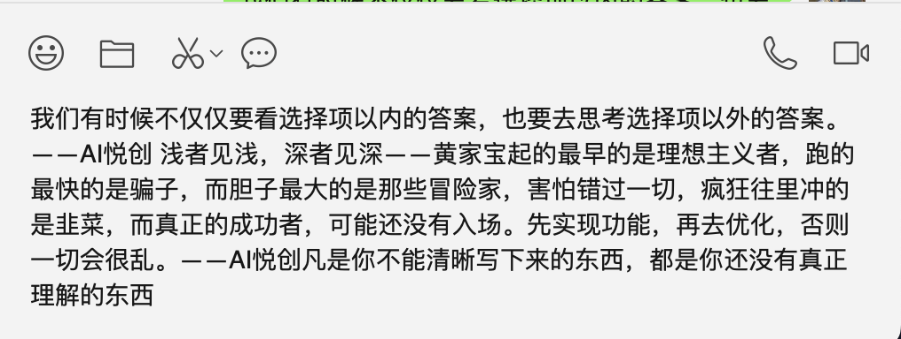
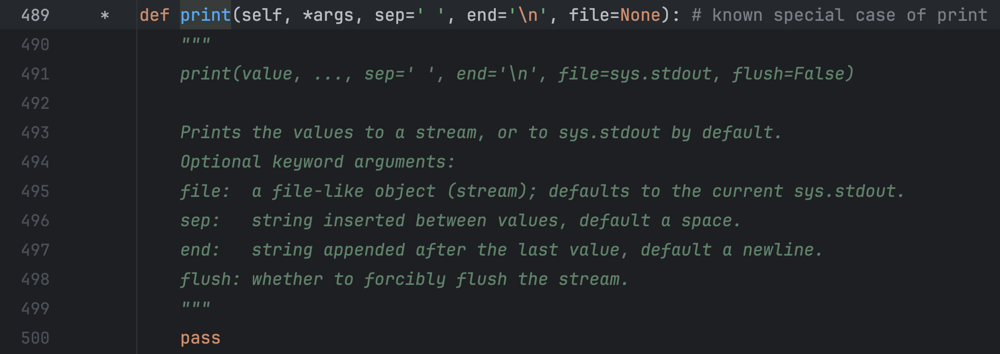

!!! warning "警告"
    正负控制方向，数字大小控制步长。
!!! info
    这里是一个 warning 提示块的内容
!!! important
    这里是一个 important 提示块的内容
!!! tip
    这里是一个 tip 提示块的内容
!!! note "注"
    这里是一个 note 提示块的内容
!!! danger
    这里是一个 danger 提示块的内容


这里有一个行内公式：$E = mc^2$

`$E = mc^2$`

这里有一个块级公式：

$$
\int_{0}^{\pi} \sin(x)\,dx = 2
$$


## 1. 字符串的定义

**字符串是由字母、数字和特殊字符来组成的序列。**


## 2. 创建字符串

**如何创建字符串？**

——使用 **<span style="color:orange">单引号、双引号</span>或者<span style="color:orange">三引号</span>**。

```python
name = 'bornforthis'
number = "18"
paragraph = '''Hello,Bornforthis!
Hello,World!'''
paragraph_two = """Hello,Bornforthis!
Hello,World!"""
```

**为什么 Python 同时支持三种创建字符串的方法？**

```python
string = 'I am bornforthis.'  # 在英文当中的常规表达式
print(string)
```

但是英文当中可以缩写如下：

```python
string = 'I'm bornforthis.'  # 在英文当中也可以这样缩写
print(string)


# 输出
  File "/Users/huangjiabao/GitHub/iMac/Pycharm/StudentCoder/39-YDN/lesson2.py", line 15
    string = 'I'm bornforthis.'  # 在英文当中也可以这样缩写
                ^
SyntaxError: invalid syntax
```

**因为，开头是单引号，所以 Python 会寻找到下一个第一次出现的单引号进行匹配。而第一个单引号不在字符串的末尾，所以导致整个字符串异常。（没有完全包裹字符串全部内容）**

如何解决上面描述的问题呢？——使用双引号。

```python
string = "I'm bornforthis."  # 外面使用双引号进行包裹即可
print(string)

# 输出
I'm bornforthis.
```

- 有时候我们需要字符串里面有单引号或双引号，此时发挥作用： **<span style="color:orange">单双引号混用，是第一个原因</span>**

那么三引号呢？

假设我们现在需要存储如下文本：

```python
我们有时候不仅仅要看选择项以内的答案，也要去思考选择项以外的答案。——AI悦创

浅者见浅，深者见深——黄家宝

起的最早的是理想主义者，跑的最快的是骗子，而胆子最大的是那些冒险家，害怕错过一切，疯狂往里冲的是韭菜，而真正的成功者，可能还没有入场。

先实现功能，再去优化，否则一切会很乱。——AI悦创

凡是你不能清晰写下来的东西，都是你还没有真正理解的东西
```

放入字符串，我们如何在 Python 代码实现呢？

```python
string = "我们有时候不仅仅要看选择项以内的答案，也要去思考选择项以外的答案。——AI悦创

浅者见浅，深者见深——黄家宝

起的最早的是理想主义者，跑的最快的是骗子，而胆子最大的是那些冒险家，害怕错过一切，疯狂往里冲的是韭菜，而真正的成功者，可能还没有入场。

先实现功能，再去优化，否则一切会很乱。——AI悦创

凡是你不能清晰写下来的东西，都是你还没有真正理解的东西"  # 外面使用双引号进行包裹即可
print(string)

# 输出
  File "/Users/huangjiabao/GitHub/iMac/Pycharm/StudentCoder/39-YDN/lesson2.py", line 15
    string = "我们有时候不仅仅要看选择项以内的答案，也要去思考选择项以外的答案。——AI悦创
                                                     ^
SyntaxError: EOL while scanning string literal
```

常规的单引号、双引号是不支持多行文本，但是有一个方法可以间接实现看似多行文本，但实际是单行，在每一行的末尾添加  `\`：

```python
string = "我们有时候不仅仅要看选择项以内的答案，也要去思考选择项以外的答案。——AI悦创 \
\
浅者见浅，深者见深——黄家宝\
\
起的最早的是理想主义者，跑的最快的是骗子，而胆子最大的是那些冒险家，害怕错过一切，疯狂往里冲的是韭菜，而真正的成功者，可能还没有入场。\
\
先实现功能，再去优化，否则一切会很乱。——AI悦创\
\
凡是你不能清晰写下来的东西，都是你还没有真正理解的东西"  # 外面使用双引号进行包裹即可
print(string)

# 输出
我们有时候不仅仅要看选择项以内的答案，也要去思考选择项以外的答案。——AI悦创 浅者见浅，深者见深——黄家宝起的最早的是理想主义者，跑的最快的是骗子，而胆子最大的是那些冒险家，害怕错过一切，疯狂往里冲的是韭菜，而真正的成功者，可能还没有入场。先实现功能，再去优化，否则一切会很乱。——AI悦创凡是你不能清晰写下来的东西，都是你还没有真正理解的东西
```

从上面的输出可知，每行结尾添加 `\` 只能实现看起来换行，实际上还是一行。「就是：一行显示不完，换行显示而已，但是本身还是一行」



此时，我们使用三引号测试：

```python
string = """我们有时候不仅仅要看选择项以内的答案，也要去思考选择项以外的答案。——AI悦创 

浅者见浅，深者见深——黄家宝

起的最早的是理想主义者，跑的最快的是骗子，而胆子最大的是那些冒险家，害怕错过一切，疯狂往里冲的是韭菜，而真正的成功者，可能还没有入场。

先实现功能，再去优化，否则一切会很乱。——AI悦创

凡是你不能清晰写下来的东西，都是你还没有真正理解的东西"""  # 外面使用双引号进行包裹即可
print(string)


# 输出
我们有时候不仅仅要看选择项以内的答案，也要去思考选择项以外的答案。——AI悦创 

浅者见浅，深者见深——黄家宝

起的最早的是理想主义者，跑的最快的是骗子，而胆子最大的是那些冒险家，害怕错过一切，疯狂往里冲的是韭菜，而真正的成功者，可能还没有入场。

先实现功能，再去优化，否则一切会很乱。——AI悦创

凡是你不能清晰写下来的东西，都是你还没有真正理解的东西
```

可以从上面的输出可知，原本什么格式，输出就是什么格式。「原样输出」「三个单引号的效果和上面一样」

- **<span style="color:orange">三个单引号或者三个双引号，实现原样输出。</span>**
- **<span style="color:orange">多行注释</span>**
- **<span style="color:orange">单双三引号混用</span>**（代码略）



## 3. 字符串长度

如何获取一个字符串的长度呢？——使用 `len()`

**`len()`: 返回字符串中字符长度或者字符数。**

```python
paragraph = "Hello,Bornforthis!"
print(len(paragraph))

# 输出
18
```

在使用 len 获取字符串长度时，是从数字 1 开始数的。


## 4. 字符串中的字符获取

### 4.1 获取单个字符

```python
string = "bornforthis"
# 获取字符 b
select = string[0]
print(select)

# 提取 f
select = string[4]
print(select)

# s 「使用三种方法实现」
select1 = string[10]
select2 = string[len(string) - 1]
select3 = string[-1]
print(select1, select2, select3)

# 输出
b
f
s s s
```

### 4.2 获取多个连续字符「子字符串」

```python
string = "bornforthis"
"""
语法: string = "bornforthis"
select = string[start: end]
PS: end 记得 +1
"""
# 获取字符 bor
select = string[0:2]  # bo
select = string[0:3]  # bor
print(select)

# 提取 for
select = string[4:7]
print(select)

# this
select = string[7:12]
print(select)

# 输出
bor
for
this
```

### 4.3 获取多个不连续的字符

```python
string = "0123456789"
"""
语法: string = "0123456789"
select = string[start: end: sep]
PS: end 记得 +1
"""
# 获取字符 02468
select = string[0:len(string):2]
print(select)

# 提取 13579
select = string[1:len(string):2]
print(select)

# 提取 bnri
string = "bornforthis"
select = string[0: len(string):3]
print(select)

# 提取 ofts
select = string[1: len(string):3]
print(select)

# 输出
02468
13579
bnri
ofts
```

### 4.4 优化

如果，我们要提取的字符是从开头到结尾，则我们可以省略开头和结尾，留空即可。

所以上面 4.3 的代码可以等价如下：

```python
string = "0123456789"
"""
语法: string = "0123456789"
select = string[:: sep]
PS: end 记得 +1
"""
# 获取字符 02468
select = string[::2]
print(select)

# 提取 13579
select = string[1::2]
print(select)

# 提取 bnri
string = "bornforthis"
select = string[::3]
print(select)

# 提取 ofts
select = string[1::3]
print(select)

# 输出
02468
13579
bnri
ofts
```

### 4.5 字符串倒序

#### 4.5.1 实现

字符串的第三个位置，控制的是字符提取的方向。默认为正数 1，如果我们改成 -1，则会变成反方向。


```python
string = "bornforthis"
reverse = string[::-1]
print(reverse)

# 输出
sihtrofnrob
```

#### 4.5.2 存在的问题

::: info 思考🤔

上面代码 `string[::-1]` 前两位省略了什么数字？尝试填写上去。

:::

你有可能是这么想的：

```python
string = "bornforthis"
# print(len(string))
select = string[0:11:-1]
print(select)  # 无结果
```

想必你也发现了，没有得到结果也没有报错。

**Why？**


由上面分析，我们应该如何解决？

#### 4.5.3 解决方法

##### 4.5.3.1 方法一：调换位置

- 能否解决：可以
- 存在什么问题？：少了一个字符

```python
string = "bornforthis"
select = string[11:0:-1]
print(select)  # sihtrofnro
```

**为什么少一个字符？**

——存在一个悖论，因为结束🔚是 0，但是 `0 + 1` 时得到 1，而 1 是从左到右的第二个字符。故而 +1 是无法实现和解决了。

但是，我们可以利用不写结尾，得到最后一个缺失的字符：`string[11::-1]` 。

虽然解决，但是我们偏离了我的一开始的问题：**前两位省略了什么数字？**「因为，又回到了一开始省略的状态」

##### 4.5.3.2 方法二：重写开始结尾

**想想字符串的有序性，从右到左。**

为什么要纠结前面两个空的数字是多少？——为了之后得到某一部分的字符倒序。

```python
string = "bornforthis"
select = string[-1:-12:-1]
print(select)  # sihtrofnrob
```


**小试牛刀：** 获取 `rofn`

```python
string = "bornforthis"
select = string[-5:-9:-1]
print(select)  # rofn
```

## 5. 字符串内置方法

### 5.1 .upper()

将字符串内容，全部转成大写。

```python
string = "bornforthis"
upper_string = string.upper()
print(upper_string)

# ---output---
BORNFORTHIS
```

### 5.2 .lower()

将字符串的内容，全部转成小写。

```python
string = "BORNFORTHIS"
lower_string = string.lower()
print(lower_string)

# ---output---
bornforthis
```

### 5.3 .capitalize()

将字符串首字母，转换成大写。「只对第一个字母大写，其它后面的字符会变成小写」

```python
string = "bornForthis To Aiyc"
capitalize_string = string.capitalize()
print(capitalize_string)

# ---output---
Bornforthis to aiyc
```

### 5.4 .title()

将字符串中的每个单词的首字母，转换成大写，其余的字符都转换成小写。

```python
string = "bornforthis to aiyc"
title_string = string.title()
print(title_string)

# ---output---
Bornforthis To Aiyc


string = "bornforthis-to-aiyc"  # 不管是什么间隔，都会转换成首字母大写
title_string = string.title()
print(title_string)

# ---output---
Bornforthis-To-Aiyc


string = "bornforThis to aiYc"  # 其余的字符都转换成小写
title_string = string.title()
print(title_string)

# ---output---
Bornforthis To Aiyc
```

### 5.5 .startswith()

检测字符串是不是以特定字符或单词开头，返回布尔值。

```python
string = "bornforthis"
startswith_string = string.startswith("b")
print(startswith_string)

# ---output---
True

string = "bornforthis"
startswith_string = string.startswith("bo")
print(startswith_string)

# ---output---
True


string = "bornforthis"
startswith_string = string.startswith("p")
print(startswith_string)

# ---output---
False

string = "bornforthis"
startswith_string = string.startswith("b1")
print(startswith_string)

# ---output---
False
```

### 5.6 .endswith()

检测字符串是不是以特定字符或单词结尾，返回布尔值。

```python
string = "bornforthis"
endswith_string = string.endswith("s")
print(endswith_string)

# ---output---
True

string = "bornforthis"
endswith_string = string.endswith("is")
print(endswith_string)

# ---output---
True

string = "bornforthis"
endswith_string = string.endswith("i")
print(endswith_string)

# ---output---
False

string = "bornforthis"
endswith_string = string.endswith("s6")
print(endswith_string)

# ---output---
False
```

### 5.7 .count()

计算特定字符或单词在目标字符串中存在的次数。

```python
string = "bornforthis"
count_string = string.count('r')
print(count_string)

# ---output---
2

string = "bornforthis"
count_string = string.count('or')
print(count_string)

# ---output---
2

string = "bornforthis"
count_string = string.count('a')
print(count_string)

# ---output---
0


string = "bornforthis"
count_string = string.count('ap')
print(count_string)

# ---output---
0
```

### 5.8 .find()

寻找目标字符或单词在特定字符串中，第一次出现的下标。「也就是出现重复的，也只是返回第一次出现的下标」如果是查找单词，那么 `find()` 返回目标单词的第一个字符的下标。

如果，查询的字符或单词不存在，则返回 `-1`。

```python
string = "bornforthis"
find_string = string.find('b')
print(find_string)

# ---output---
0

string = "bornforthis"
find_string = string.find('a')
print(find_string)

# ---output---
-1


string = "bornforthis"
find_string = string.find('for')
print(find_string)

# ---output---
4


string = "bornforthis"
find_string = string.find('aiyc')
print(find_string)

# ---output---
-1
```

### 5.9 .index()

寻找目标字符或单词在特定字符串中，第一次出现的下标。如果是查找单词，那么 `index()` 返回目标单词的第一个字符的下标。

如果，查询的字符或单词不存在，则**报错**。

```python
string = "bornforthis"
index_result = string.index('b')
print(index_result)

# ---output---
0

string = "bornforthis"
index_result = string.index('a')
print(index_result)

# ---output---
Traceback (most recent call last):
  File "/Users/huangjiabao/GitHub/iMac/Pycharm/StudentCoder/39-YDN/lesson3.py", line 83, in <module>
    index_result = string.index('a')
ValueError: substring not found

string = "bornforthis"
index_result = string.index('for')
print(index_result)

# ---output---
4

string = "bornforthis"
index_result = string.index('aiyc')
print(index_result)

# ---output---
Traceback (most recent call last):
  File "/Users/huangjiabao/GitHub/iMac/Pycharm/StudentCoder/39-YDN/lesson3.py", line 83, in <module>
    index_result = string.index('aiyc')
ValueError: substring not found
```

### 5.10 .isdigit()

判断字符串是不是纯数字字符串，字符串中但凡有一个字符是非数字，则返回 False。

```python
string = "12345678"
isdigit_result = string.isdigit()
print(isdigit_result)

# ---output---
True

string = "123 45678"
isdigit_result = string.isdigit()
print(isdigit_result)

# ---output---
False
```

### 5.11 .isalpha()

判断字符串是不是纯字母字符串，字符串中但凡有一个非字母的，则返回 False。

```python
string = "bornforthis"
isalpha_result = string.isalpha()
print(isalpha_result)

# ---output---
True


string = "born forthis"
isalpha_result = string.isalpha()
print(isalpha_result)

# ---output---
False
```

### 5.12 .isalnum()

判断字符串是不是纯数字或纯字母、纯数字字母字符串，字符串中但凡出现非数字、字母元素，则返回 False。

```python
string = "bornforthis"
boolean = string.isalnum()
print(boolean)

# ---output---
True


string = "12345678"
boolean = string.isalnum()
print(boolean)

# ---output---
True


string = "bornforthis8888888888"
boolean = string.isalnum()
print(boolean)

# ---output---
True


string = "bornforthis 8888888888"
boolean = string.isalnum()
print(boolean)

# ---output---
False
```

### 5.13 .isupper()

判断字符串中的字母否全大写，全大写则返回 True，否则返回 False。

```python
string = "BORNFORTHIS"
boolean = string.isupper()
print(boolean)

# ---output---
True


string = "BORNFORTHIS12-、"
boolean = string.isupper()
print(boolean)

# ---output---
True


string = "BORNforthis"
boolean = string.isupper()
print(boolean)

# ---output---
False


string = "bornforthis"
boolean = string.isupper()
print(boolean)

# ---output---
False
```

### 5.14 .islower()

判断字符串中字母是不是全小写，全小写则返回 True，否则返回 False。

```python
string = "bornforthis"
boolean = string.islower()
print(boolean)

# ---output---
True

string = "bornforthis121-、"
boolean = string.islower()
print(boolean)

# ---output---
True

string = "bornforthisA121-、"
boolean = string.islower()
print(boolean)

# ---output---
False
```

### 5.15 .isspace()

判断字符串是否为纯空格，多少个空格都可以。纯空格则返回 True，否则返回 False。

```python
string = "   "
boolean = string.isspace()
print(boolean)

# ---output---
True

string = ""
boolean = string.isspace()
print(boolean)

# ---output---
False

string = "bornforthis"
boolean = string.isspace()
print(boolean)

# ---output---
False
```

### 5.16 .strip()

默认去掉目标字符串的前后空白字符，如果指定参数，则去掉指定字符。

```python
string = "   bornforthis   "
strip_string = string.strip()
print("原本的字符串:", string)
print("去掉前后空白字符后:", strip_string)

# ---output---
原本的字符串:    bornforthis   
去掉前后空白字符后: bornforthis


string = "-----bornforthis-----"
strip_string = string.strip('-')
print("原本的字符串:", string)
print("去掉前后 '-' 字符后:", strip_string)

# ---output---
原本的字符串: -----bornforthis-----
去掉前后 '-' 字符后: bornforthis


string = "--- --bornforthis-- ---"
strip_string = string.strip('-')  # 只去掉连续的减号
print("原本的字符串:", string)
print("去掉前后 '-' 字符后:", strip_string)

# ---output---
原本的字符串: --- --bornforthis-- ---
去掉前后 '-' 字符后:  --bornforthis-- 


string = "--- --bornforthis-- ---"  # 如果想去掉减号和空格呢？
strip_string = string.strip('- ')  # 填入要去掉的字符「不计较先后顺序」
print("原本的字符串:", string)
print("去掉前后 '- ' 字符后:", strip_string)

# ---output---
原本的字符串: --- --bornforthis-- ---
去掉前后 '- ' 字符后: bornforthis
```

### 5.17 .lstrip()

默认去掉字符串左边的空白字符，如果指定参数，则去掉左边的指定字符。

```python
string = "   bornforthis   "
lstrip_string = string.lstrip()
print("原本的字符串:", string)
print("去掉左边空白字符后:", lstrip_string)

# ---output---
原本的字符串:    bornforthis   
去掉左边空白字符后: bornforthis   


string = "----bornforthis----"
lstrip_string = string.lstrip('-')
print("原本的字符串:", string)
print("去掉左边 '-' 后:", lstrip_string)


# ---output---
原本的字符串: ----bornforthis----
去掉左边 '-' 后: bornforthis----

string = "-- --bornforthis----"
lstrip_string = string.lstrip('- ')  # 不分先后顺序
print("原本的字符串:", string)
print("去掉左边 '- ' 后:", lstrip_string)

# ---output---
原本的字符串: -- --bornforthis----
去掉左边 '- ' 后: bornforthis----
```

### 5.18 .rstrip()

默认去掉字符串右边的空白字符，如果指定参数，则去掉右边的指定字符。

```python
string = "   bornforthis   "
rstrip_string = string.rstrip()
print("原本的字符串:", string)
print("去掉右边空白字符后:", rstrip_string)

# ---output---
原本的字符串:    bornforthis   
去掉右边空白字符后:    bornforthis


string = "----bornforthis----"
rstrip_string = string.rstrip('-')
print("原本的字符串:", string)
print("去掉右边 '-' 后:", rstrip_string)

# ---output---
原本的字符串: ----bornforthis----
去掉右边 '-' 后: ----bornforthis


string = "----bornforthis-- --"
rstrip_string = string.rstrip('- ')  # 不分先后顺序
print("原本的字符串:", string)
print("去掉右边 '- ' 后:", rstrip_string)

# ---output---
原本的字符串: ----bornforthis-- --
去掉右边 '- ' 后: ----bornforthis
```

### 5.19 .replace()

`.replace(old, new, count)` 第一个位置传入待替换的旧「old」字符，第二个位置传入要替换的新字符「new」，默认替换全部，count 控制替换次数。

```python
string = "   bornforthis   "
replace_string = string.replace(' ', '*')  # 把空白字符替换成 *
print("原本的字符串:", string)
print("替换后:", replace_string)

# ---output---
原本的字符串:    bornforthis   
替换后: ***bornforthis***


string = "ai-bornforthis-ai"
replace_string = string.replace('ai', 'love')  # 把 ai 替换成 love，默认全部替换
print("原本的字符串:", string)
print("替换后:", replace_string)

# ---output---
原本的字符串: ai-bornforthis-ai
替换后: love-bornforthis-love


string = "ai-bornforthis-ai"
replace_string = string.replace('ai', 'love', 1)  # 替换一次
print("原本的字符串:", string)
print("替换后:", replace_string)

# ---output---
原本的字符串: ai-bornforthis-ai
替换后: love-bornforthis-ai
```

### 5.20 .split()

`.split(sep, maxsplit)` 以特定字符进行分割，默认空格分割。如果传入参数「sep」，则以参数进行分割。返回分割后的列表。maxsplit 用于控制分割几次。

```python
string = "ai bornforthis ai"
split_string = string.split()
print("原本的字符串:", string)
print("分割后:", split_string)

# ---output---
原本的字符串: ai bornforthis ai
分割后: ['ai', 'bornforthis', 'ai']


string = "ai-bornforthis-ai"
split_string = string.split('-')  # 以 - 好分割
print("原本的字符串:", string)
print("分割后:", split_string)

# ---output---
原本的字符串: ai-bornforthis-ai
分割后: ['ai', 'bornforthis', 'ai']


string = "ai-bornforthis-love"
split_string = string.split('-', 1)
print("原本的字符串:", string)
print("分割后:", split_string)

# ---output---
原本的字符串: ai-bornforthis-love
分割后: ['ai', 'bornforthis-love']
```

::: warning

注意⚠️：使用 spilt 分割时，不管每个字符之间有几个空格，都将会正常的分割出来。

```python
s = "ai  bornforthis  ai    book"
new_s = s.split()
print(new_s)

# ---output---
['ai', 'bornforthis', 'ai', 'book']
```

当我们指定 split 的间隔时，spilt 会严格按照我们指定的分割符号来分割。

```python
s = "ai  bornforthis  ai    book"
new_s = s.split(' ')
print(new_s)

# ---output---
['ai', '', 'bornforthis', '', 'ai', '', '', '', 'book']
```

上面多输出的结果空字符串，就是证明。

:::

### 5.21 .rsplit()

`.rsplit(sep, maxsplit)` 从字符串右边进行分割，也可以传入参数「sep」，进行指定分割。返回分割后的列表。maxsplit 指定分割次数。

```python
string = "ai-bornforthis-love"
rsplit_string = string.rsplit('-')
print("原本的字符串:", string)
print("分割后:", rsplit_string)

# ---output---
原本的字符串: ai-bornforthis-love
分割后: ['ai', 'bornforthis', 'love']


string = "ai-bornforthis-love"
rsplit_string = string.rsplit('-', 1)
print("原本的字符串:", string)
print("分割后:", rsplit_string)

# ---output---
原本的字符串: ai-bornforthis-love
分割后: ['ai-bornforthis', 'love']
```

### 5.22 .join()

以特定字符使字符串间隔。

```python
string = "bornforthis"
join_string = '-'.join(string)
print("原本的字符串:", string)
print("拼接后:", join_string)

# ---output---
原本的字符串: bornforthis
分割后: b-o-r-n-f-o-r-t-h-i-s
```

## 6. 字符串格式化

```python
string = "Hi Bornforthis,Welcome to XiaMen."
print(string)

# ---output---
Hi Bornforthis,Welcome to XiaMen.
```

- 所存在的问题：需要换一个人名或者地区，就需要重新创建一个全新的字符串。
- 我们更希望有类似模版，让我们不同的人名、地面填写进去。而不是每个人都从头创建一个新字符串。

当然，这个时候有可能会想到使用字符串的加法，但字符串加法存在问题。

```python
name = "Bornforthis"
region = "XiaMen"
string1 = "Hi "
string2 = ",Welcome to "
string3 = "."
result = string1 + name + string2 + region + string3
print(result)

# ---output---
Hi Bornforthis,Welcome to XiaMen.
```

由上面的代码可知，虽然实现了。但是很繁琐，如果更复杂的字符串就不合适了。

而且另一个问题就是，在 Python 中不同的数据类型不能直接相加，除非强制转换类型为字符串：

```python
string = "Money is " + 190
print(string)


# ---output---
Traceback (most recent call last):
  File "/Users/huangjiabao/GitHub/iMac/Pycharm/StudentCoder/40-YEWENTE/demo1.py", line 1, in <module>
    string = "Money is " + 190
TypeError: can only concatenate str (not "int") to str


string = "Money is " + str(190)
print(string)
# ---output---
Money is 190
```

—— **format** 就应运而生了。

### 6.1 .format()

1. 单个花括号 `{}`

```python
string = "Hi {},Welcome to XiaMen.".format("aiyuechuang")
print(string)

# ---output---
Hi aiyuechuang,Welcome to XiaMen.


template_string = "Hi {},Welcome to XiaMen."
print(template_string.format("Bornforthis"))

# ---output---
Hi Bornforthis,Welcome to XiaMen.


new_string = template_string.format("AI悦创")
print(new_string)


# ---output---
Hi AI悦创,Welcome to XiaMen.
```

2. 一个花括号以上「按顺序填充」

```python
string = "Hi {},Welcome to {}.".format("aiyuechuang", "厦门")
print(string)

# ---output---
Hi aiyuechuang,Welcome to 厦门.


template_string = "Hi {},Welcome to {}."
print(template_string.format("Bornforthis", "上海"))

# ---output---
Hi Bornforthis,Welcome to 上海.


new_string = template_string.format("AI悦创", "北京")
print(new_string)

# ---output---
Hi AI悦创,Welcome to 北京.
```

3. 多个花括号指定位置

```python
string = "Hi {1},Welcome to {0}.".format("厦门", "aiyuechuang")
print(string)

# ---output---
Hi aiyuechuang,Welcome to 厦门.


template_string = "Hi {1},Welcome to {0}."
print(template_string.format("上海", "Bornforthis"))

# ---output---
Hi Bornforthis,Welcome to 上海.


new_string = template_string.format("北京", "AI悦创")
print(new_string)

# ---output---
Hi AI悦创,Welcome to 北京.
```

4. 参数指定

```python
string = "Hi {name},Welcome to {region}.".format(region='厦门', name='aiyuechuang')
print(string)

# ---output---
Hi aiyuechuang,Welcome to 厦门.

template_string = "Hi {name},Welcome to {region}."
print(template_string.format(name="Bornforthis", region='上海'))

# ---output---
Hi Bornforthis,Welcome to 上海.

new_string = template_string.format(name='AI悦创', region='北京')
print(new_string)

# ---output---
Hi AI悦创,Welcome to 北京.
```

5. 保留指定小数位

```python
string = "Money is {:.3f}.".format(190)  # .3f 保留三位小数
print(string)

# ---output---
Money is 190.000.
```

> 此时，放入数字是不会报错了。

### 6.2 f

1. 直接读取变量

```python
name = "Bornforthis"
region = "厦门"
string = f"Hi {name},Welcome to {region}."
print(string)

# ---output---
Hi Bornforthis,Welcome to 厦门.
```

2. 保留小数位

```python
money = 190
string = f"Money is {money:.3f}."
print(string)


# ---output---
Money is 190.000.
```

### 6.3 % 格式化

- `%d`: 整数
- `%s`: 字符串
- `%f`: 浮点数

1. 单个位置传入

```python
string = "Money is %d"
new_s = string % 13
print(new_s)
print(string % 19)
string = "Money is %d" % 190
print(string)

# ---output---
new_string: Money is 13
直接放: Money is 19
Money is 190
```

2. 多个位置传入

```python
string = "Money is %d %s"
new_s = string % (13, '发大财')
print(new_s)
print(string % (888, '暴富'))
string = "Money is %d %s" % (190, "超有钱")
print(string)

# ---output---
Money is 13 发大财
Money is 888 暴富
Money is 190 超有钱
```

```python
string = "Money is %d %s"
new_s = string % (13, 'make a million')
print(new_s)
print(string % (888, 'sudden wealth'))
string = "Money is %d %s" % (190, 'super rich')
print(string)

# ---output---
Money is 13 make a million
Money is 888 sudden wealth
Money is 190 super rich
```

3. 保留小数位

```python
string = "Money is %.3f"
new_s = string % 19
print(new_s)
print(string % 18)
string = "Money is %.3f" % 180
print(string)


# ---output---
Money is 19.000
Money is 18.000
Money is 180.000
```

### 6.4 f 和 format、% 的优缺点

`format` 和 `%` 都像模版，提前做好模版后面有需要时可以直接使用；

而 `f` 就像在银行当中，柜员边问你边登记，不能提前做好模版。


## 7. 字符串不可变性

字符串是不可变的，不可以改变字符串中的任何元素，如需改变字符串中的元素，则需要新建一个字符串。

```python
s = "hello bornforthis"
s[0] = "a"

# ---output---
Traceback (most recent call last):
  File "/Users/huangjiabao/GitHub/iMac/Pycharm/StudentCoder/39-YDN/lesson3.py", line 2, in <module>
    s[0] = "a"
TypeError: 'str' object does not support item assignment
```

除了使用 replace 还可以使用字符串拼接：

```python
s = "hello bornforthis"
news = "a" + s[1:]
print(news)

# ---output---
aello bornforthis
```

## 8. 字符串转义

| 转义字符 | 含义                               | 例子                     |
| -------- | ---------------------------------- | ------------------------ |
| `\\`     | 反斜杠符号，为了在字符串中得到 `\` | `s = "bor\\nforthis"`    |
| `\b`     | 退格，类似删除键                   | `s = "bornff\borthis"`   |
| `\n`     | 换行                               | `s = "bornfor\nthis"`    |
| `\t`     | 制表符                             | `s = "born\tfor\tthis"`  |
| `r`      | 取消转义「R 和 r」都可以           | `s = r"born\tfor\tthis"` |

示例代码：

```python
s = "bor\\nforthis"
print(s)

# ---output---
bor\nforthis


s = "bornff\borthis"
print(s)

# ---output---
bornforthis

s = "bornfor\nthis"
print(s)

# ---output---
bornfor
this


s = "born\tfor\tthis"
print(s)

# ---output---
born    for    this
```

## 9. 字符串的连接

```python
s1 = 'born'
s2 = 'forthis'
print(s1 + s2)  # 形成了一个字符串
print(s1, s2)  # 还是两个独立的字符串

# ---output---
bornforthis
born forthis


s1 = '*-love-'
print(s1 * 10)

# ---output---
*-love-*-love-*-love-*-love-*-love-*-love-*-love-*-love-*-love-*-love-
```

我想在上面的输出添加末尾加一个 `*` 怎么办呢？

```python
原本:*-love-*-love-*-love-*-love-*-love-*-love-*-love-*-love-*-love-*-love-
目标:*-love-*-love-*-love-*-love-*-love-*-love-*-love-*-love-*-love-*-love-*
```

**思考一下，如何实现。**

```python
s1 = '*-love-'
print(s1 * 10, end='*')
```

## 10. 读取用户输入

### 10.1 input() 基本使用

使用 `input()` 获取用户输入。

```python
user_input = input()
print(user_input)

# ---output---
bornforthis
bornforthis
```

### 10.2 input() 使用输入提示

但是上面的代码，有点小问题：在运行的时候并不能很直观的知道，程序需要我们输入，何况非程序员用户呢？


如何解决？——使用输入提示。

`input()` 函数里面支持我们写入字符串进行提示。

```python
user_input = input('Enter your name:>>>')
print("user input name:", user_input)

# ---output---
Enter your name:>>>bornforthis
user input name: bornforthis
```


### 10.3 input() 的特点

#### 10.3.1 input() 得到类型皆为字符串「str」

```python
In [2]: type(input(':>>>'))  # 使用 type 检测 input 获取用户输入之后的数据类型
:>>>bornforthis
Out[2]: str

In [3]: type(input(':>>>'))
:>>>12
Out[3]: str

In [4]: type(input(':>>>'))
:>>>12.1
Out[4]: str

In [5]: type(input(':>>>'))
:>>>(1, 2, 3, 4)
Out[5]: str

In [6]: type(input(':>>>'))
:>>>[1, 2, 3, 4]  
Out[6]: str

In [7]: type(input(':>>>'))
:>>>{1, 2, 3, 4, 5}
Out[7]: str

In [8]: type(input(':>>>'))
:>>>{'a': 19, 'b': 20}
Out[8]: str

In [9]: type(input(':>>>'))
:>>>True
Out[9]: str
```

通过上面的代码示例，我们可以知道：通过 `input()` 获取用户输入，得到的数据类型都是**字符串**。

得知 `input()` 的特点后，如何解决这个问题呢？——用户如何实现：直接输入原有的类型并得到原有的类型。

#### 10.3.2 方法一：强制类型转换

```python
In [10]: n = int(input(':>>>'))
:>>>12

In [11]: type(n)
Out[11]: int

In [12]: # 存在一些问题

In [13]: s = list(input(':>>>'))
:>>>[1, 2, 3, 4, 5]

In [14]: s  # 把每一个字符拆开
Out[14]: ['[', '1', ',', ' ', '2', ',', ' ', '3', ',', ' ', '4', ',', ' ', '5', ']']

In [15]: type(s)
Out[15]: list

In [16]: b = bool(input(':>>>'))
:>>>True

In [17]: b
Out[17]: True

In [18]: type(b)
Out[18]: bool
```

- 适合：数字「整数、浮点数」、字符串、布尔型
- 不适合：列表、元组、字典、集合

#### 10.3.3 方法二：使用 eval()

1. `eval()` 的妙用

```python
In [28]: s = eval(input(':>>>'))
:>>>12

In [29]: type(s), s
Out[29]: (int, 12)

In [30]: s = eval(input(':>>>'))
:>>>[1, 2, 3]

In [31]: type(s), s
Out[31]: (list, [1, 2, 3])

In [32]: s = eval(input(':>>>'))
:>>>(1, 2, 3)

In [33]: type(s), s
Out[33]: (tuple, (1, 2, 3))

In [34]: s = eval(input(':>>>'))
:>>>{1, 2, 3}

In [35]: type(s), s
Out[35]: (set, {1, 2, 3})

In [36]: s = eval(input(':>>>'))
:>>>True

In [37]: type(s), s
Out[37]: (bool, True)

In [38]: s = eval(input(':>>>'))
:>>>{'a': 1, 'b': 2}

In [39]: type(s), s
Out[39]: (dict, {'a': 1, 'b': 2})
```

2. `eval()` 伴随着的问题

上面的代码看似解决了我们所遇到的问题，但是也伴随着我们需要注意的问题。

```python
In [40]: s = eval(input(':>>>'))
:>>>string 
---------------------------------------------------------------------------
NameError                                 Traceback (most recent call last)
Cell In[40], line 1
----> 1 s = eval(input(':>>>'))

File <string>:1

NameError: name 'string' is not defined
```

稍微分析一下 `eval()` 的功能“大概”实现原因：

- input 获取用户输入，得到字符串类型。

```python
In [44]: s = input(':>>>')
:>>>[1, 2, 3]

In [45]: s
Out[45]: '[1, 2, 3]'
```

从上面的代码可以得知，eval 大概率实现的是去掉字符串左右两边的引号。「这个地方 eval 或许不是按我说的实现，但是为了让你们更好理解原理，先这样来。」

所以，为什么会导致上面的报错呢？

1. 获取用户输入：`s = eval(input(':>>>'))`
2. 其中 input 会得到 `'string'`，而通过 `eval` 转换之后，就类似于 `string` 变量。但是我们实际上我们在我们之前的代码中，并没有创建 string 这个变量。
3. 故而报错，当然没有通过上面的分析也可以大概预料到问题，因为报错很直观：`NameError: name 'string' is not defined` 。
4. 所以，解决方法很直白：
    1. 一种是你在获取用户输入之前直接提前创建一个叫做 string 的变量；「显然，不是我们想要的」
    2. 另一种则是输入的时，有意加上单引号或者双引号、三引号。

::: code-tabs

@tab Code 1

```python
In [50]: string = 'hello this string'

In [51]: s = eval(input(':>>>'))
:>>>string

In [52]: s
Out[52]: 'hello this string'

In [53]: num = 12

In [54]: s = eval(input(':>>>'))
:>>>num

In [55]: type(s), s
Out[55]: (int, 12)

In [56]: s = eval(input(':>>>'))
:>>>'string'

In [57]: type(s), s
Out[57]: (str, 'string')
```

@tab Code 2

```python
In [56]: # Step 1: 探究 eval 的实现原理

In [57]: s = input(':>>>')
:>>>[1, 2, 3]  

In [58]: s
Out[58]: '[1, 2, 3]'

In [59]: s = eval(input(":>>>"))
:>>>[1, 2, 3]

In [60]: s
Out[60]: [1, 2, 3]

In [61]: # eval 大体是实现把字符串外面的引号去掉，实现变回原本的数据类型

In [62]: # Step 2: 探究报错原因

In [63]: s = input(':>>>')
:>>>look

In [64]: s
Out[64]: 'look'

In [65]: # 我们可以观察输出的是 'look'，如果直接去掉 look 左右的引号将变成：变量。但变量没有被定义，所以
    ...: 会报错。

In [66]: s = eval(input(":>>>"))
:>>>look
---------------------------------------------------------------------------
NameError                                 Traceback (most recent call last)
Cell In[66], line 1
----> 1 s = eval(input(":>>>"))

File <string>:1

NameError: name 'look' is not defined

In [67]: # Step 3: 解决方法

In [68]: # 既然 eval 是直接去掉 look 外面的引号，导致变量不存在报错。所以我有两种解决方法：

In [69]: # 方法一：提前创建一个变量

In [70]: # 方法二：输入的时，有意加上单引号或者双引号、三引号

In [71]: look = '我提前创建一个 look 变量'  # 方法一

In [72]: s = eval(input(":>>>"))
:>>>look

In [73]: s
Out[73]: '我提前创建一个 look 变量'

In [74]: s = eval(input(":>>>"))  # 方法二：我提前加一个引号，input 也会给它一个引号，最后有两对引号，eval 拆掉一对引号，还剩一对引号。——成功得到字符串
:>>>'look'

In [75]: s
Out[75]: 'look'
```

:::

3. `eval()` 小技巧

任务要求：获取户输入，实现两位的加减乘除。

```python
In [58]: eval(input(':>>>'))
:>>>1 + 1
Out[58]: 2  # eval(input(':>>>')) == eval('1 + 1') == 2

In [59]: eval(input(':>>>'))
:>>>2 - 1
Out[59]: 1  # eval(input(':>>>')) == eval('2 - 1') == 1

In [60]: eval(input(':>>>'))
:>>>9 * 8
Out[60]: 72  # eval(input(':>>>')) == eval('9 * 8') == 72

In [61]: eval(input(':>>>'))
:>>>9 / 3
Out[61]: 3.0
```

#### 10.3.4 浅谈 input 的设计理念

在 Python 中，使用 `input()` 函数时，它会从标准输入（通常是键盘）读取一行文本，并且这一行文本会被当作字符串处理。这是因为用户输入的内容可能包括各种字符，包括数字、字母和符号。由于 `input()` 函数不能预知用户将要输入什么类型的数据，它默认将输入内容作为字符串返回，这样可以保持最大的灵活性和兼容性。

如果你需要将这个字符串转换为其他数据类型，比如整数或浮点数，你可以使用相应的转换函数，例如 `int()` 或 `float()`，来进行转换。这里是一个简单的例子：

```python
# 使用 input() 获取用户输入，并存储为字符串
user_input = input("请输入一个数字: ")

# 将字符串转换为整数
number = int(user_input)

# 打印转换后的整数
print("输入的整数是:", number)
```

在这个例子中，如果用户输入的不是一个有效的整数，`int()` 函数会抛出一个 `ValueError`。因此，在实际使用中，通常需要加上错误处理来确保程序的健壮性。


## 11. 小试牛刀

获取用户连续输入的两个整数，得到两个整数的和。

**要求：**

- 只能使用一个 input 函数；
- 用户输入格式：num1 num2
- 输出计算结果；

**输入：**

```python
5 6
```

**输出：**

```python
11
```

::: code-tabs

@tab Code1

```python
nums = eval(input(':>>>').replace(' ', '+'))
print(nums)
```

@tab Code2

```python
nums = input(':>>>').split()
sum = int(nums[0]) + int(nums[1])
print(sum)
```

:::


