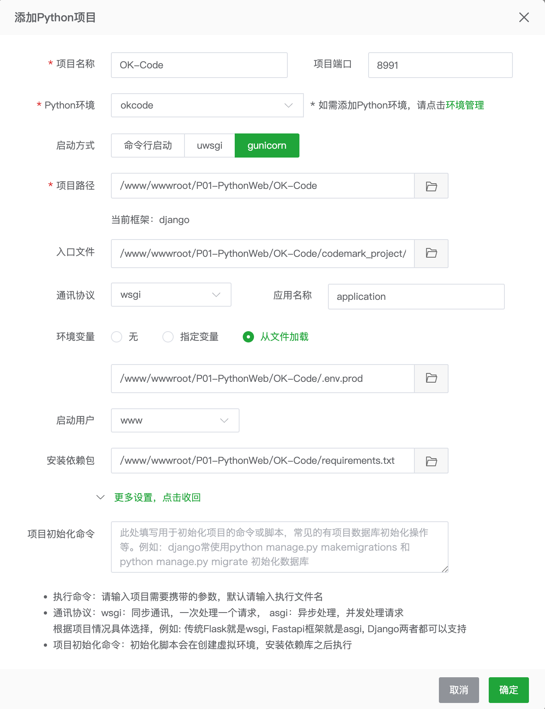

# CodeMark 部署文档

本文档基于当前项目结构编写，适用于长期维护部署：

```text
OK/
├── manage.py
├── codemark_project/
│   └── settings/
│       ├── base.py
│       ├── dev.py
│       └── prod.py
├── apps/
├── content/articles/
├── templates/
├── static/
├── staticfiles/
├── media/sharecode/
├── logs/
└── requirements.txt
```

## 部署前准备

生产环境建议使用：

- Python 3.11+。
- Nginx。
- Gunicorn。
- `codemark_project.settings.prod`。

运行时数据说明：

- `static/`：源码静态资源目录。
- `staticfiles/`：`collectstatic` 生成目录，给 Nginx 读取。
- `media/sharecode/`：分享代码、二维码、资源文件等运行时数据。
- `logs/`：Django 日志目录。

重要：`media/sharecode/` 是用户分享数据，升级或重新部署时不要删除，建议定期备份。

## 命令行部署

以下以 Ubuntu/Debian 和 `/www/wwwroot/codemark-ok` 为例，实际路径请按服务器调整。

### 1. 安装系统依赖

```bash
sudo apt update
sudo apt install -y python3 python3-venv python3-pip nginx git
```

### 2. 拉取代码

```bash
cd /www/wwwroot
git clone <your-repo-url> codemark-ok
cd /www/wwwroot/codemark-ok
```

如果是上传代码包，解压后进入项目根目录即可。

### 3. 创建虚拟环境并安装依赖

```bash
python3 -m venv .venv
source .venv/bin/activate
pip install --upgrade pip
pip install -r requirements.txt
pip install gunicorn
```

### 4. 配置生产环境变量

生成一个 `DJANGO_SECRET_KEY`：

```bash
source .venv/bin/activate
python - <<'PY'
from django.core.management.utils import get_random_secret_key
print(get_random_secret_key())
PY
```

创建 `.env.prod`，内容示例：

```bash
DJANGO_SETTINGS_MODULE=codemark_project.settings.prod
DJANGO_SECRET_KEY=替换为上一步生成的密钥
DJANGO_DEBUG=0
DJANGO_ALLOWED_HOSTS=example.com,www.example.com,127.0.0.1,localhost
DJANGO_LOG_LEVEL=INFO
```

注意：`.env.prod` 不要提交到 Git。

### 5. 初始化运行目录和静态资源

```bash
cd /www/wwwroot/codemark-ok
./scripts/init_deploy.sh .env.prod
```

该脚本会自动创建 `logs/`、`media/sharecode/`、`staticfiles/`，加载 `.env.prod`，执行 `collectstatic`，并运行 `python manage.py check`。如果项目根目录存在 `.venv`，脚本会优先使用 `.venv`；否则会使用当前命令所在的 Python 环境。

如果是从旧版本迁移，确认旧的 `sharecode/` 数据已经迁移到：

```text
media/sharecode/
```

### 6. 使用 Gunicorn 启动

先手动验证：

```bash
source .venv/bin/activate
set -a
source .env.prod
set +a
gunicorn codemark_project.wsgi:application \
  --bind 127.0.0.1:8991 \
  --workers 3 \
  --timeout 120
```

浏览器访问服务器反向代理地址，确认页面正常后再配置 systemd。

### 7. 配置 systemd

创建服务文件：

```bash
sudo nano /etc/systemd/system/codemark-ok.service
```

写入：

```ini
[Unit]
Description=CodeMark OK Django Service
After=network.target

[Service]
User=www-data
Group=www-data
WorkingDirectory=/www/wwwroot/codemark-ok
EnvironmentFile=/www/wwwroot/codemark-ok/.env.prod
ExecStart=/www/wwwroot/codemark-ok/.venv/bin/gunicorn codemark_project.wsgi:application --bind 127.0.0.1:8991 --workers 3 --timeout 120
Restart=always
RestartSec=5

[Install]
WantedBy=multi-user.target
```

启动服务：

```bash
sudo systemctl daemon-reload
sudo systemctl enable codemark-ok
sudo systemctl start codemark-ok
sudo systemctl status codemark-ok
```

查看日志：

```bash
journalctl -u codemark-ok -f
```

### 8. 配置 Nginx

创建站点配置：

```bash
sudo nano /etc/nginx/sites-available/codemark-ok
```

写入，替换域名和路径：

```nginx
server {
    listen 80;
    server_name example.com www.example.com;

    client_max_body_size 100m;

    location /static/ {
        alias /www/wwwroot/codemark-ok/staticfiles/;
        expires 30d;
        add_header Cache-Control "public";
    }

    location / {
        proxy_pass http://127.0.0.1:8991;
        proxy_set_header Host $host;
        proxy_set_header X-Real-IP $remote_addr;
        proxy_set_header X-Forwarded-For $proxy_add_x_forwarded_for;
        proxy_set_header X-Forwarded-Proto $scheme;
        proxy_redirect off;
    }
}
```

不建议直接暴露整个 `/media/` 目录，因为 `media/sharecode/` 中包含用户分享代码和项目数据。当前项目会通过 `/share/<project_id>` 和 `/share_asset/...` 读取需要展示的内容。

启用站点：

```bash
sudo ln -s /etc/nginx/sites-available/codemark-ok /etc/nginx/sites-enabled/codemark-ok
sudo nginx -t
sudo systemctl reload nginx
```

### 9. 后续更新

```bash
cd /www/wwwroot/codemark-ok
git pull
source .venv/bin/activate
pip install -r requirements.txt
./scripts/init_deploy.sh .env.prod
sudo systemctl restart codemark-ok
```

更新前建议备份：

```bash
tar -czf media-sharecode-$(date +%Y%m%d%H%M%S).tar.gz media/sharecode
```

## 宝塔部署

以下以宝塔面板 + Nginx + Python 项目管理器为例。

### 1. 安装宝塔组件

在宝塔软件商店安装：

- Nginx。
- Python 项目管理器。
- Git，可选。

### 2. 创建网站

在宝塔面板中：

1. 进入「网站」。
2. 添加站点。
3. 域名填写你的域名，例如 `example.com`。
4. 根目录建议设置为：

```text
/www/wwwroot/codemark-ok
```

如果你通过 Git 拉代码：

```bash
cd /www/wwwroot
git clone <your-repo-url> codemark-ok
```

如果通过面板上传压缩包，解压到 `/www/wwwroot/codemark-ok`。

### 3. 创建虚拟环境

在宝塔终端执行：

```bash
cd /www/wwwroot/codemark-ok
python3 -m venv .venv
source .venv/bin/activate
pip install --upgrade pip
pip install -r requirements.txt
pip install gunicorn
```

### 4. 配置环境变量文件

在项目根目录创建 `.env.prod`：

```bash
DJANGO_SETTINGS_MODULE=codemark_project.settings.prod
DJANGO_SECRET_KEY="替换为生产密钥"
DJANGO_DEBUG=0
DJANGO_ALLOWED_HOSTS=example.com,www.example.com,127.0.0.1,localhost
DJANGO_LOG_LEVEL=INFO
```

生成生产密钥命令：

```bash
cd /www/wwwroot/codemark-ok
source .venv/bin/activate
python - <<'PY'
from django.core.management.utils import get_random_secret_key
print(get_random_secret_key())
PY
```

or

```bash
source .venv/bin/activate

python -c "from django.core.management.utils import get_random_secret_key; print(get_random_secret_key())"
```


### 5. 初始化运行目录和静态资源

```bash
cd /www/wwwroot/codemark-ok
./scripts/init_deploy.sh .env.prod
```

该脚本会自动创建 `logs/`、`media/sharecode/`、`staticfiles/`，加载 `.env.prod`，执行 `collectstatic`，并运行 `python manage.py check`。如果项目根目录存在 `.venv`，脚本会优先使用 `.venv`；否则会使用宝塔当前选中的 Python 环境。

我喜欢下面的操作：

```bash
mkdir -p logs media/sharecode staticfiles
```

如果是从旧版本迁移，确认旧的 `sharecode/` 数据已经迁移到：

```bash
media/sharecode/
```

收集静态资源：

```bash
source .venv/bin/activate
set -a
source .env.prod
set +a
python manage.py collectstatic --noinput
python manage.py check
```

使用 Gunicorn 启动：

先手动验证：

```bash
source .venv/bin/activate
set -a
source .env.prod
set +a
gunicorn codemark_project.wsgi:application \
  --bind 127.0.0.1:8991 \
  --workers 3 \
  --timeout 120
```

浏览器访问服务器反向代理地址，确认页面正常后再配置 systemd。

看这个：[https://github.com/AndersonHJB/OK-Code/blob/3c44653e8159ab4119f1b33a299ea30c3b78840c/docs/deployment.md](https://github.com/AndersonHJB/OK-Code/blob/3c44653e8159ab4119f1b33a299ea30c3b78840c/docs/deployment.md)



### 6. Python 项目管理器配置

在宝塔「Python 项目管理器」中添加项目：

- 项目名称：`codemark-ok`
- 项目路径：`/www/wwwroot/codemark-ok`
- Python 版本：选择服务器 Python 3。
- 启动方式：Gunicorn。
- 启动文件/模块：`codemark_project.wsgi:application`
- 端口：`8991`
- 运行用户：建议使用网站用户或 `www`。

如果面板支持自定义启动命令，使用：

```bash
/www/wwwroot/codemark-ok/.venv/bin/gunicorn codemark_project.wsgi:application --bind 127.0.0.1:8991 --workers 3 --timeout 120
```

如果面板没有环境变量输入框，可以在启动命令前加载 `.env.prod`：

```bash
bash -lc 'cd /www/wwwroot/codemark-ok && set -a && source .env.prod && set +a && .venv/bin/gunicorn codemark_project.wsgi:application --bind 127.0.0.1:8991 --workers 3 --timeout 120'
```

### 7. 宝塔 Nginx 反向代理

进入站点设置，配置反向代理：

- 代理名称：`codemark-ok`
- 目标 URL：`http://127.0.0.1:8991`
- 发送域名：`$host`

然后进入站点的 Nginx 配置，在 `server` 中增加静态资源规则：

```nginx
location /static/ {
    alias /www/wwwroot/codemark-ok/staticfiles/;
    expires 30d;
    add_header Cache-Control "public";
}

location / {
    proxy_pass http://127.0.0.1:8991;
    proxy_set_header Host $host;
    proxy_set_header X-Real-IP $remote_addr;
    proxy_set_header X-Forwarded-For $proxy_add_x_forwarded_for;
    proxy_set_header X-Forwarded-Proto $scheme;
    proxy_redirect off;
}
```

同样不建议直接配置 `/media/` 静态访问，避免暴露 `media/sharecode/` 中的用户分享数据。

保存后点击「重载配置」或执行：

```bash
nginx -t
bt reload
```

### 8. 宝塔 HTTPS

在宝塔站点设置中申请 SSL 证书，开启强制 HTTPS。开启后确认 `.env.prod` 的域名在 `DJANGO_ALLOWED_HOSTS` 内。

### 9. 宝塔更新流程

```bash
cd /www/wwwroot/codemark-ok
git pull
source .venv/bin/activate
pip install -r requirements.txt
./scripts/init_deploy.sh .env.prod
```

然后在 Python 项目管理器中重启项目。

更新前备份分享数据：

```bash
cd /www/wwwroot/codemark-ok
tar -czf media-sharecode-$(date +%Y%m%d%H%M%S).tar.gz media/sharecode
```

## 常见问题

### 页面能打开但 CSS/JS 丢失

检查是否执行：

```bash
python manage.py collectstatic --noinput
```

并确认 Nginx：

```nginx
location /static/ {
    alias /www/wwwroot/codemark-ok/staticfiles/;
}
```

### 访问提示 DisallowedHost

检查 `.env.prod`：

```bash
DJANGO_ALLOWED_HOSTS=example.com,www.example.com,127.0.0.1,localhost
```

修改后重启 Gunicorn。

### 分享链接 404

检查运行时数据是否存在：

```bash
ls -lah media/sharecode
```

旧版本迁移时需要把根目录旧 `sharecode/` 移到：

```text
media/sharecode/
```

### 日志文件无权限

确认运行用户可以写入：

```bash
sudo chown -R www-data:www-data logs media
sudo chmod -R 775 logs media
```

宝塔环境中通常需要把 `www-data:www-data` 替换为 `www:www`。
